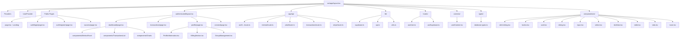

```mermaid
    flowchart TB

        App[src/app/layout.tsx]
        
        App --> Providers[Providers]
        App --> UserProvider[UserProvider]
        
        %% Public Routes
        App --> PublicPages[Public Pages]
        PublicPages --> HomePage[page.tsx - Landing]
        PublicPages --> Login[auth/login/page.tsx]
        PublicPages --> Register[auth/register/page.tsx]
        PublicPages --> Success[success/page.tsx]
        
        %% Authenticated Routes
        App --> AuthLayout[authenticated/layout.tsx]
        AuthLayout --> Dashboard[dashboard/page.tsx]
        AuthLayout --> Transactions[transactions/page.tsx]
        AuthLayout --> Profile[profile/page.tsx]
        AuthLayout --> Connect[connect/page.tsx]
        
        %% Profile Components
        Profile --> ProfileInfo[ProfileInformation.tsx]
        Profile --> BillingSection[BillingSection.tsx]
        Profile --> GroupManagement[GroupManagement.tsx]
        
        %% Dashboard Components
        Dashboard --> MetricsPanel[components/MetricsPanel]
        Dashboard --> TransactionsList[components/TransactionsList]
        Dashboard --> Charts[components/Charts]
        
        %% API Routes
        App --> APIRoutes[app/api]
        APIRoutes --> AuthAPI[auth/.../route.ts]
        APIRoutes --> InternalAPI[internal/route.ts]
        APIRoutes --> PlaidAPI[plaid/route.ts]
        APIRoutes --> TransactionsAPI[transactions/route.ts]
        APIRoutes --> StripeAPI[stripe/route.ts]
        
        %% Core Libraries
        App --> Libraries[lib/]
        Libraries --> SupabaseClient[supabase.ts]
        Libraries --> APIClient[api.ts]
        Libraries --> Utils[utils.ts]
        
        %% Hooks
        App --> Hooks[hooks/]
        Hooks --> UseUser[useUser.ts]
        Hooks --> UseSupabase[useSupabase.ts]
        
        %% Contexts
        App --> Contexts[contexts/]
        Contexts --> UserContext[userContext.tsx]
        
        %% Types
        App --> Types[types/]
        Types --> DatabaseTypes[database.types.ts]
        
        %% UI Components
        App --> UIComponents[components/ui/]
        UIComponents --> AlertDialog[alert-dialog.tsx]
        UIComponents --> Button[button.tsx]
        UIComponents --> Card[card.tsx]
        UIComponents --> Dialog[dialog.tsx]
        UIComponents --> Input[input.tsx]
        UIComponents --> Select[select.tsx]
        UIComponents --> Skeleton[skeleton.tsx]
        UIComponents --> Table[table.tsx]
        UIComponents --> Tabs[tabs.tsx]
        UIComponents --> Toast[toast.tsx]
```