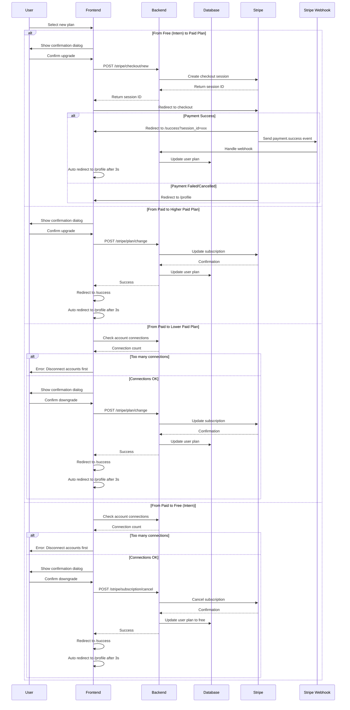

# Flow: Change Subscription Plan

## Purpose

- Allow users to upgrade or downgrade their plan via the frontend.
- Manage billing and plan enforcement using Stripe and internal logic.
- Ensure user limits are respected during downgrades (e.g. max account connections).
- Reflect plan changes immediately in the database after confirmation.

## Prerequisites

- The user must already be signed in and have an active account.
- Stripe customer must already exist and be linked to the user record.
- All Stripe products, prices, and webhook endpoints must be configured and deployed.
- Backend must know the user’s current plan and connected account count before allowing downgrades.
- Webhooks must be live and properly secured.

## Sequence Diagram

## Success Criteria

- User is shown a clear and accurate confirmation dialog before making changes.
- After confirming, the user is taken through a Stripe checkout or redirected back instantly for non-checkout changes.
- Once the plan change is successful, user sees a success screen and is redirected to `/profile` after a short delay.
- If the plan change fails (cancelled checkout, validation issue), the user is returned to `/profile` with appropriate feedback.
- In downgrade scenarios, users are clearly blocked if they exceed the allowed account limits.

### Expected Results

- `POST /stripe/checkout/new` creates a new checkout session for Intern → Paid upgrades.
- Stripe sends `payment.success` webhook on successful checkout, triggering the backend to update the user's plan.
- `POST /stripe/plan/change` updates existing subscription for lateral or higher/lower paid plan swaps.
- Downgrade checks call the backend to count currently connected accounts and compare with the plan's limit.
- `POST /stripe/subscription/cancel` cancels the subscription and backend updates the user’s plan to `intern`.
- Plan updates are written to the `users` table in Supabase.
- Stripe events are logged and tracked in webhook handler logs.

### Error Scenarios

- If the user has more connected accounts than the target plan allows → show blocking error and prevent downgrade.
- If Stripe checkout session creation fails → display error and stay on pricing page.
- If webhook fails or isn’t received → the user's plan may remain unchanged until manually corrected.
- If a downgrade is confirmed but Stripe update fails → surface error and revert UI state.
- If user navigates away during checkout → they are redirected to `/profile` with no change applied.

## Developer Notes

- Stripe plan pricing IDs are mapped in backend constants and used for session creation or plan changes.
- Webhook receiver validates events using Stripe signing secret before updating plans.
- Plan enforcement logic (e.g. max accounts) is enforced both in backend API and optionally in frontend UI.
- Connection count is read from the `accounts` table per `userid`.
- All redirects after changes point to `/success`, which then forwards to `/profile` after 3 seconds.

### Known Issues

- If webhook fails silently, plan changes may be delayed until next sync or require manual admin fix.
- Users who downgrade may accidentally lose access to features if no guardrails exist.
- Stripe metadata is not synced back to frontend unless explicitly fetched after update.
