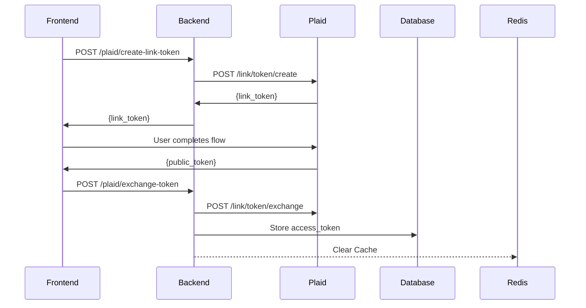

# Flow: Connect Bank Account

## Purpose

- Allow users to connect a financial account to Fiscility via the Plaid Link interface.
- Securely exchange the public token for an access token and store it in the backend.
- Trigger any necessary cache clearing or follow-up data syncs.

## Prerequisites

- The user must already be signed up and logged in.
- The user must not have exceeded the maximum number of allowed accounts for their plan.
- The backend must have a valid Plaid client ID and secret.
- The frontend must be configured with the correct Plaid environment and Link setup.

## Sequence Diagram

## Success Criteria

- User is able to open the Plaid Link modal and go through the account connection process.
- User is redirected or shown a success message after connecting their account.
- No errors or reloads occur during the process.
- UI visibly reflects that a new account has been connected (e.g. dashboard updates).

### Expected Results

- A `link_token` is successfully generated and sent to the frontend.
- `public_token` received from Plaid is exchanged for an `access_token`.
- The `access_token` and associated account metadata are stored in the database.
- Redis cache (if applicable) is cleared for this user to trigger fresh data load.
- The new account is associated with the correct `userid` in the accounts table.
- Logs or analytics events are triggered to track successful connection.
- Errors from Plaid or DB are caught and handled.

### Error Scenarios

- If token generation fails (`/plaid/create-link-token`), the frontend should show a generic error.
- If the user closes Plaid Link without completing, no action is taken and no error shown.
- If the public token exchange fails, show an error and prevent partial DB writes.
- If the database insert fails after exchange, do not create duplicate access tokens or accounts.
- If the user has exceeded their plan’s account limit, block the connection attempt with a clear error.

## Developer Notes

- Plaid Link is initialized on the frontend with the `link_token` from `/plaid/create-link-token`.
- On success, Plaid returns a `public_token` which is passed to `/plaid/exchange-token`.
- The backend then uses `client.item_public_token_exchange()` to get an `access_token`.
- Redis is used to cache account data and is cleared on every successful connection.
- All tokens and sensitive data should be encrypted or stored securely.
- Feature is gated by plan-based account limits (handled before token creation or DB insert).

### Known Issues

- No visual confirmation if Redis clearing or backend sync fails silently.
- Rate limits from Plaid may cause token exchange to occasionally fail under load.
- Duplicate account connections from same institution not currently deduplicated.
