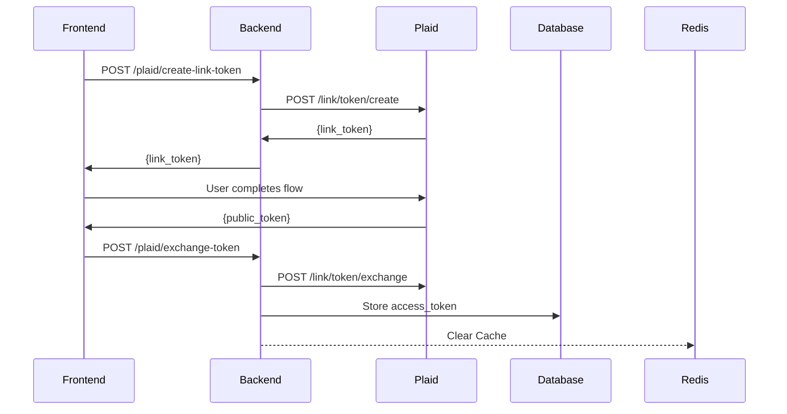

```mermaid

sequenceDiagram
    Frontend->>Backend: POST /plaid/create-link-token
    Backend->>Plaid: POST /link/token/create
    Plaid->>Backend: {link_token}
    Backend->>Frontend: {link_token}
    Frontend->>Plaid: User completes flow
    Plaid->>Frontend: {public_token}
    Frontend->>Backend: POST /plaid/exchange-token
    Backend->>Plaid: POST /link/token/exchange
    Backend->>Database: Store access_token
    Backend -->>Redis: Clear Cache

```