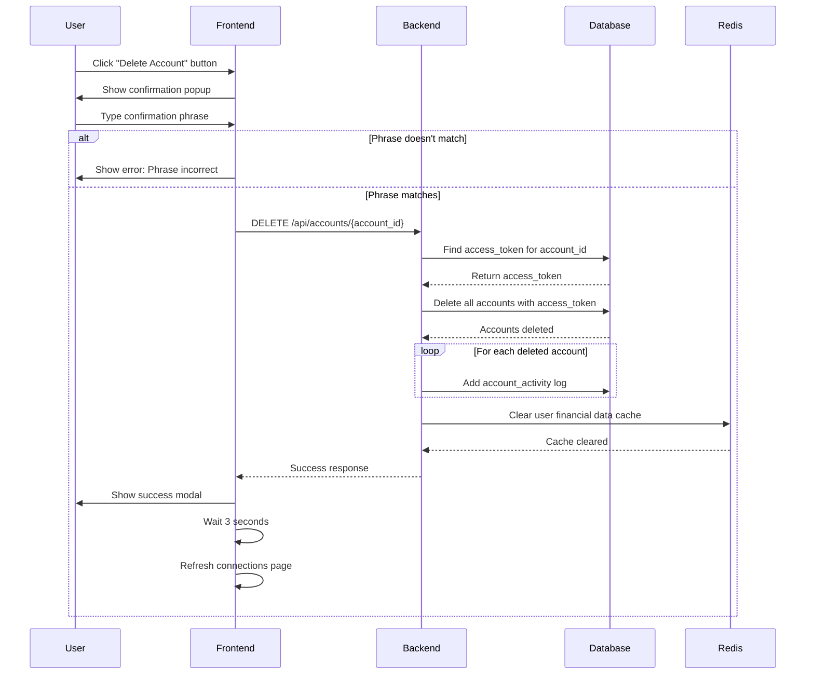

# Flow: Disconnect Bank Account

## Purpose

- Allow users to securely disconnect one or more bank accounts from Fiscility.
- Ensure all accounts using the same Plaid `access_token` are removed in one operation.
- Clear cached financial data from Redis to prevent stale or orphaned data.
- Track the account removal in the database for audit and analytics.

## Prerequisites

- The user must be signed in and viewing the connected accounts list.
- The user must correctly type the required confirmation phrase before deletion can proceed.
- The account being deleted must belong to the authenticated user.
- Redis must be available to clear the cache after deletion.

## Sequence Diagram

## Success Criteria

- User clicks the “Delete Account” button and is prompted with a confirmation modal.
- If the confirmation phrase is incorrect, a clear error message is shown and deletion is blocked.
- If the phrase is correct, the user sees a success message after deletion.
- The page automatically refreshes or reloads within 3 seconds, showing the updated list with the account removed.
- No partial deletions or UI freezes occur.

### Expected Results

- `DELETE /api/accounts/{account_id}` is called with the correct account ID.
- The backend queries the database for the associated `access_token`.
- All accounts that share the same `access_token` are deleted from the accounts table.
- For each deleted account, an `account_activity` log entry is added to the DB.
- Redis is cleared for this user's financial data to ensure a clean state.
- Backend returns a 200 success response to the frontend.
- All deletion actions are logged and auditable.

### Error Scenarios

- If the confirmation phrase does not match → block the deletion and display an inline error.
- If the account does not exist or does not belong to the user → return 404 or 403.
- If Redis is unavailable → proceed with deletion but skip cache clearing, log the failure.
- If database deletion fails → return 500 error and show user a failure modal or toast.
- If user refreshes too early or cancels the flow → deletion may complete in background but UI won’t reflect until next load.

## Developer Notes

- Access token is the identifier for all related accounts; deletion is performed by `access_token`, not just `account_id`.
- Logs in `account_activity` should include `userid`, `account_id`, and timestamp.
- Redis key(s) for the user's cache should be fully cleared on delete to prevent incorrect metrics display.
- Confirmation phrase matching is case-insensitive and validated on the frontend before the DELETE request.
- The same endpoint should block deletion if user is over account limit but tries to swap accounts manually.

### Known Issues

- There’s no optimistic UI update; delay before account disappears after success.
- Redis TTL may retain metrics cache briefly even after deletion if eviction fails.
- Logs are added per account, which may create noise if multiple accounts are deleted at once.
