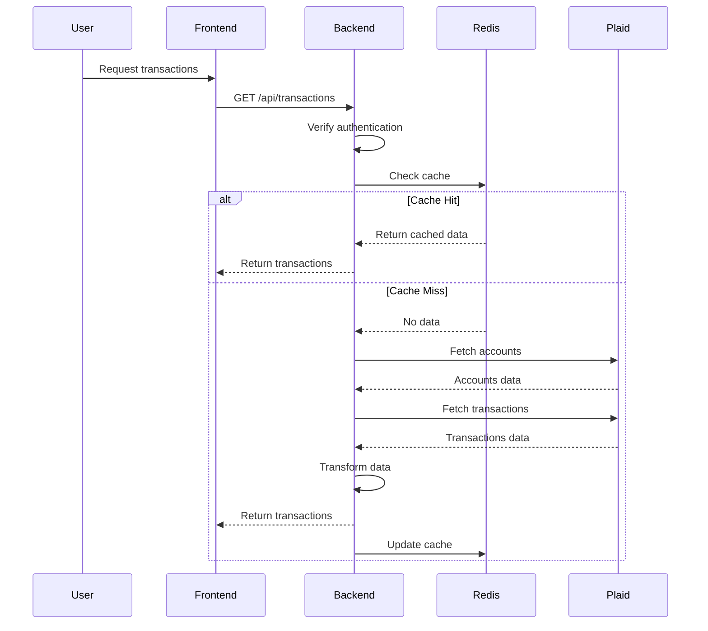

# Flow: Get Transactions

## Purpose

- Retrieve a user’s recent transactions from connected bank accounts using Plaid.
- Use Redis caching to reduce redundant calls and improve performance.
- Provide the frontend with a reliable, fast response whether data is fresh or cached.

## Prerequisites

- The user must be logged in and have at least one connected account.
- The user must not have revoked their access token.
- Redis must be accessible for checking and updating the cache.
- Plaid credentials must be valid and properly configured.

## Sequence Diagram

## Success Criteria

- The user requests their transactions from the dashboard or relevant view and sees the correct data appear within a few seconds.
- If data is already available, it loads immediately without any visible loading delay.
- If the data is not cached, the user sees a loading spinner or message until data is fetched and rendered.
- No authentication errors, timeouts, or broken views occur during the process.

### Expected Results

- The request to `/api/transactions` is received and the user is authenticated.
- Redis is queried using the correct cache key for the user.
- If cached data exists, it is returned without calling Plaid.
- If no cached data:
  - Plaid is queried for account details and transactions.
  - The transaction data is transformed into the internal format.
  - The result is returned to the frontend and saved to Redis for future use.
- Redis is updated with the latest transaction payload after a successful fetch.
- Errors from Plaid or Redis are caught and surfaced in logs.

### Error Scenarios

- If the user is not authenticated → return 401 Unauthorized.
- If Redis is unavailable → fallback to Plaid directly and skip caching.
- If Plaid account or transaction fetch fails → return error to frontend and log the exception.
- If user has no connected accounts → return empty array with status 200.
- If Plaid rate limits the request → return 429 or retry as needed.

## Developer Notes

- Endpoint is `GET /api/transactions`, protected with authentication middleware.
- Redis cache keys are namespaced by user ID and request type (`transactions`).
- Plaid fetch range is typically set to the past 30 days, configurable in the backend.
- Data transformation includes sorting, formatting, and tag enrichment if available.
- Logging should capture cache usage, query latency, and Plaid response success/failure.
- Future enhancement: support pagination or time range filters in query params.

### Known Issues

- No intelligent cache invalidation; cache is overwritten on every call.
- Transaction tags or metadata might not be cached, depending on implementation.
- Redis latency or timeout can delay response if not handled with fallback.
