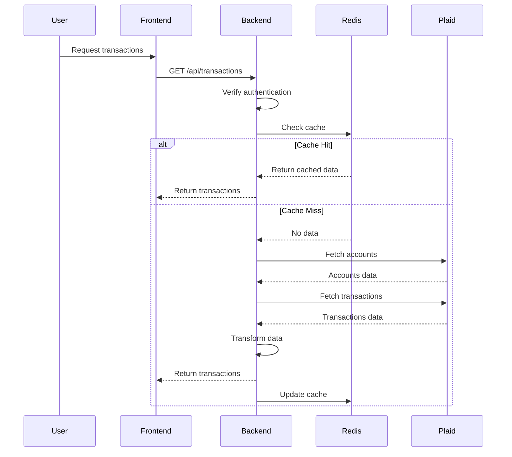

```mermaid
    sequenceDiagram
        participant User
        participant Frontend
        participant Backend
        participant Redis
        participant Plaid

        User->>Frontend: Request transactions
        Frontend->>Backend: GET /api/transactions
        Backend->>Backend: Verify authentication
        Backend->>Redis: Check cache
        alt Cache Hit
            Redis-->>Backend: Return cached data
            Backend-->>Frontend: Return transactions
        else Cache Miss
            Redis-->>Backend: No data
            Backend->>Plaid: Fetch accounts
            Plaid-->>Backend: Accounts data
            Backend->>Plaid: Fetch transactions
            Plaid-->>Backend: Transactions data
            Backend->>Backend: Transform data
            Backend-->>Frontend: Return transactions
            Backend->>Redis: Update cache
        end
```