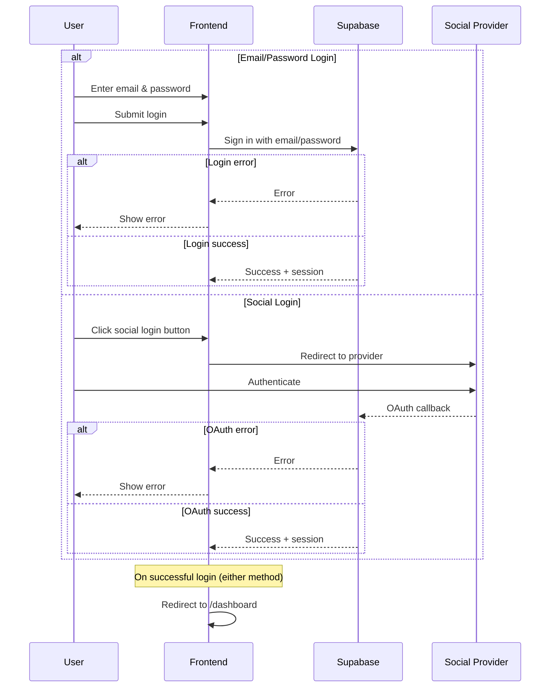

# Flow: User Login

## Purpose

This flow enables users to log into the application either using their email and password or through a supported social login provider (e.g. Google). The goal is to authenticate the user and issue a session token that grants access to protected parts of the application, like the dashboard. This flow ensures that only valid, existing users can access the platform.

## Prerequisites

- Supabase Auth is properly configured  
- Email/password and social login providers (e.g. Google) are enabled in Supabase  
- Frontend app has access to Supabase URL and public anon key  
- User account exists (for email/password login) or user has completed social sign-in before  
- OAuth credentials (e.g. Google Client ID) are set correctly in Supabase dashboard  
- Frontend handles routing after login success  

## Sequence Diagram

## Success Criteria

This flow is considered successful when a user is able to authenticate using either email/password or a social login provider and is granted access to the application via a valid session. The system should correctly handle both valid and invalid login attempts, provide clear user feedback on errors, and store the returned session securely for access control.

### Expected Results

- User successfully logs in and is redirected to `/dashboard`  
- A valid Supabase session is returned and stored on the frontend  
- No error is shown to the user on valid login  
- Social login correctly redirects back to the app and issues a session  
- Frontend reflects authenticated state (e.g., shows user dashboard)  

### Error Scenarios

- Incorrect email/password → Show specific error (e.g. "Invalid credentials")  
- Missing fields → Prevent submission with inline validation  
- Social login cancelled or fails → Show generic login error  
- Supabase returns error (e.g. network or config issue) → Show fallback error, log to Sentry  
- OAuth callback is malformed → Prevent login and surface generic error  

## Developer Notes

- Uses `supabase.auth.signInWithPassword` or `supabase.auth.signInWithOAuth` depending on method  
- Supabase returns a `session` object containing JWT and user metadata  
- Frontend should listen to `onAuthStateChange` to track login state  
- Errors should be caught and reported with relevant context (email, method, etc.)  
- Social login redirects back to the frontend via Supabase's configured OAuth callback  
- All login attempts should be logged to Sentry for observability  

### Known Issues

- No retry mechanism for failed requests due to poor network  
- OAuth error messages are generic and not user-friendly  
- Occasionally, redirect occurs before session is fully hydrated on the frontend  
