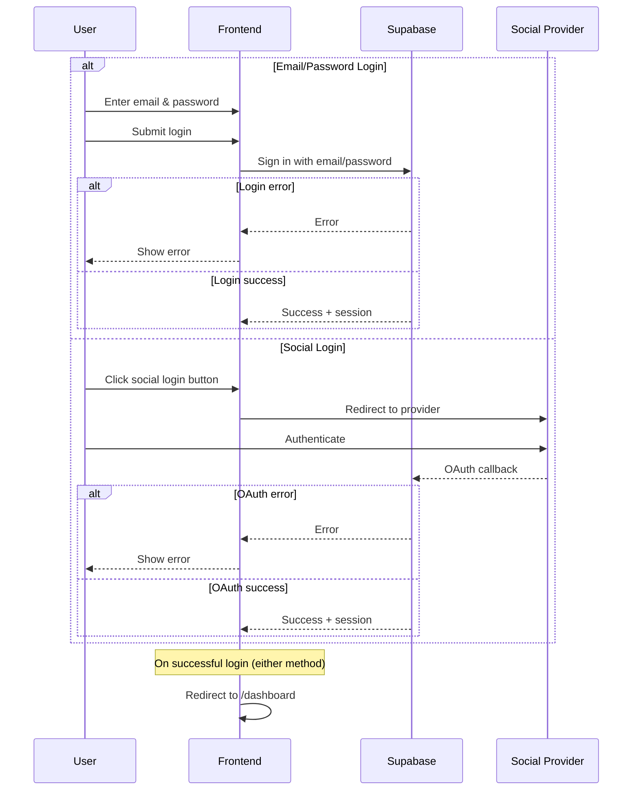

```mermaid
    sequenceDiagram
        participant User
        participant Frontend
        participant Supabase
        participant Social as Social Provider

        alt Email/Password Login
            User->>Frontend: Enter email & password
            User->>Frontend: Submit login
            Frontend->>Supabase: Sign in with email/password
            alt Login error
                Supabase-->>Frontend: Error
                Frontend-->>User: Show error
            else Login success
                Supabase-->>Frontend: Success + session
            end
        else Social Login
            User->>Frontend: Click social login button
            Frontend->>Social: Redirect to provider
            User->>Social: Authenticate
            Social-->>Supabase: OAuth callback
            alt OAuth error
                Supabase-->>Frontend: Error
                Frontend-->>User: Show error
            else OAuth success
                Supabase-->>Frontend: Success + session
            end
        end

        Note over Frontend: On successful login (either method)
        
        Frontend->>Frontend: Redirect to /dashboard
```