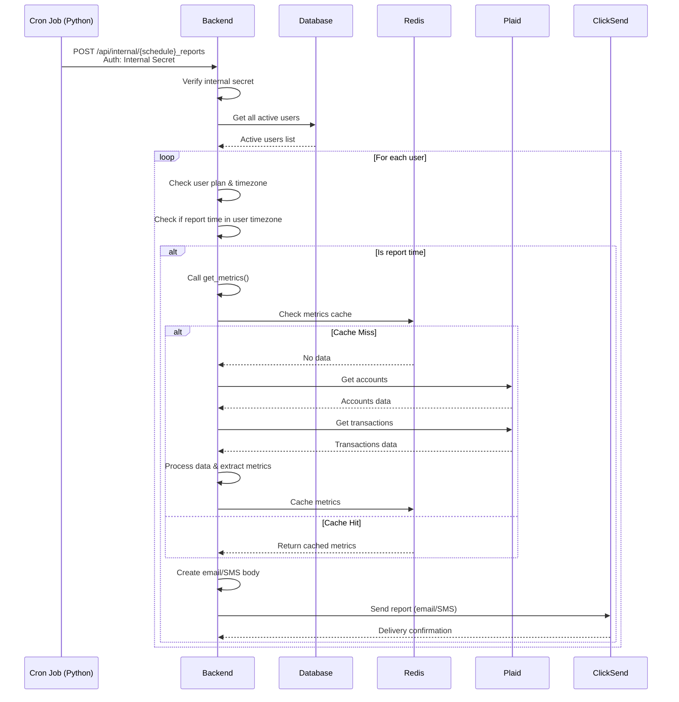

# Flow: Scheduled Reports

## Purpose

- Automatically deliver financial summary reports to users via SMS or email based on their subscription plan.
- Ensure reports are sent at the correct local time per user (daily, weekly, or monthly).
- Pull and process metrics from bank data using Plaid, cache it for reuse, and send via ClickSend.

## Prerequisites

- User must have a valid subscription plan that includes reports (e.g. Accountant or CFO).
- User must have a timezone set in their profile.
- The report must not have already been sent that day (idempotency).
- Redis must be running and accessible for caching.
- Internal auth token must be present in the scheduled job request headers.

## Sequence Diagram

## Success Criteria

- The user receives an email or SMS report at the correct local time for their timezone and schedule (daily, weekly, or monthly).
- Reports contain up-to-date financial metrics with no delays or errors shown to the user.
- The user does not receive multiple reports on the same day or at the wrong time.
- If the report fails to send (e.g. delivery error), it is silently retried or logged without interrupting the user.

### Expected Results

- Cron job triggers `POST /api/internal/{schedule}_reports` with an internal auth header.
- Backend verifies auth, retrieves all active users, and filters for users with valid plans and matching local time.
- For each user:
  - If no cached metrics exist in Redis, Plaid is queried for accounts and transactions.
  - Metrics are processed, cached in Redis, and used to build the report body.
  - Report is sent using ClickSend (email or SMS depending on schedule and plan).
  - Delivery confirmation is logged.
- No duplicate reports are sent within the same reporting window.
- Redis is used for caching metrics to reduce repeated calls to Plaid.
- Stripe, Supabase, and Plaid credentials are used as required during processing.

### Error Scenarios

- If internal auth token is missing or incorrect → request is rejected with 403 Forbidden.
- If user timezone is invalid → user is skipped and logged.
- If Redis is unavailable → Plaid is queried directly and cache is skipped.
- If Plaid request fails → report is skipped for that user and error is logged.
- If ClickSend delivery fails → response is logged; retry logic may be applied.
- If job fails partway through user list → remaining users continue unaffected.

## Developer Notes

- This flow is triggered by an external scheduler (e.g. cron job, Cloud Scheduler).
- The endpoint `/api/internal/{schedule}_reports` must be protected using internal auth logic.
- Redis keys are namespaced by user ID and metric type.
- `get_metrics()` handles cache fallback and Plaid calls internally.
- ClickSend integration handles both SMS and email with dynamic templates.
- Scheduled jobs must be run in UTC but calculate local time for each user before sending.

### Known Issues

- No automated retries for ClickSend failures yet implemented.
- Redis cache is not TTL-based — manual eviction may be needed.
- Report timestamps may drift slightly depending on job scheduling frequency and runtime.
