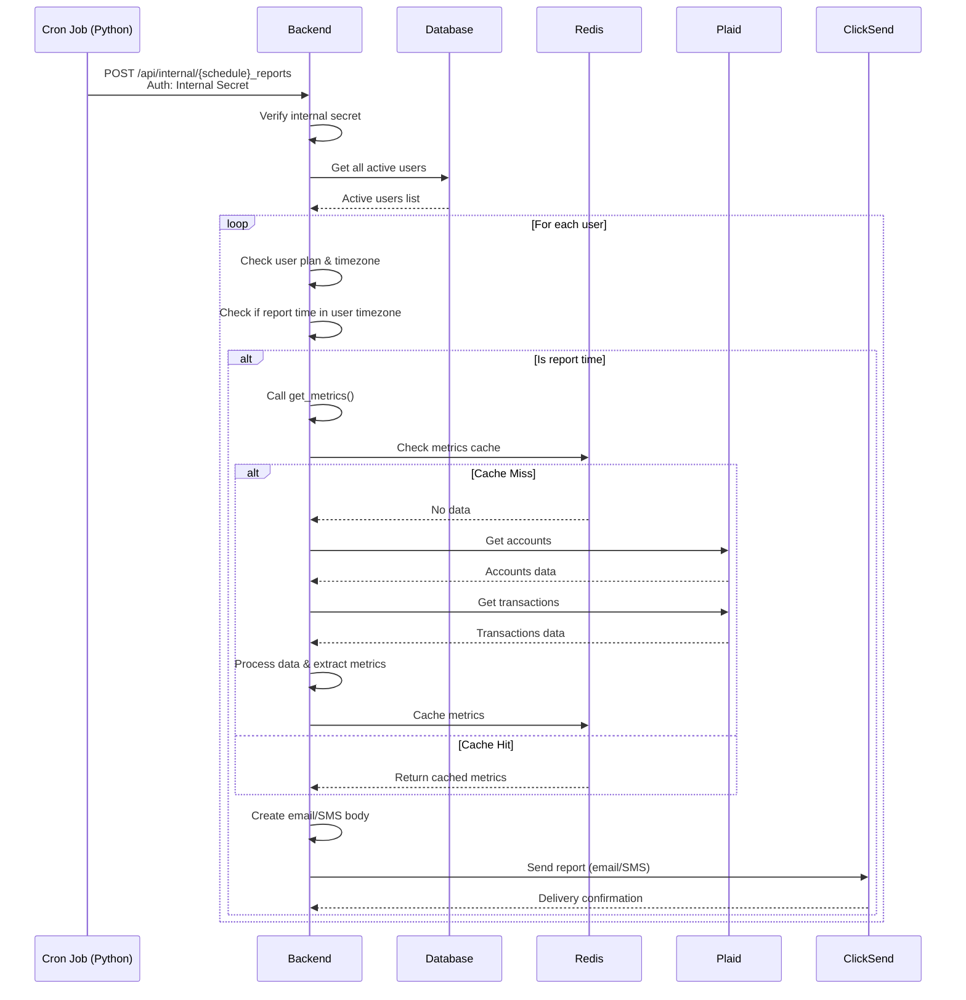

```mermaid
    sequenceDiagram
        participant Cron as Cron Job (Python)
        participant Backend
        participant DB as Database
        participant Redis
        participant Plaid
        participant ClickSend

        Cron->>Backend: POST /api/internal/{schedule}_reports<br/>Auth: Internal Secret
        Backend->>Backend: Verify internal secret
        Backend->>DB: Get all active users
        DB-->>Backend: Active users list
        
        loop For each user
            Backend->>Backend: Check user plan & timezone
            Backend->>Backend: Check if report time in user timezone
            alt Is report time
                Backend->>Backend: Call get_metrics()
                Backend->>Redis: Check metrics cache
                alt Cache Miss
                    Redis-->>Backend: No data
                    Backend->>Plaid: Get accounts
                    Plaid-->>Backend: Accounts data
                    Backend->>Plaid: Get transactions
                    Plaid-->>Backend: Transactions data
                    Backend->>Backend: Process data & extract metrics
                    Backend->>Redis: Cache metrics
                else Cache Hit
                    Redis-->>Backend: Return cached metrics
                end
                Backend->>Backend: Create email/SMS body
                Backend->>ClickSend: Send report (email/SMS)
                ClickSend-->>Backend: Delivery confirmation
            end
        end

```