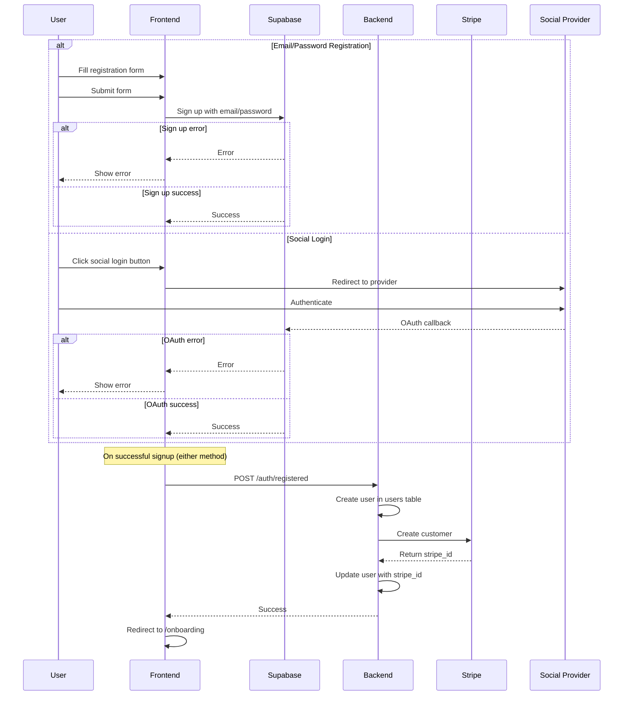

# Flow: User Sign-Up

## Purpose

- Allow new users to register via email/password or social login.
- Trigger backend actions that provision the user in Stripe and store their metadata in the database.
- Ensure the user is redirected into the product onboarding flow immediately after signup.
- Lay the foundation for identifying and segmenting users by plan.

## Prerequisites

- Supabase project has email/password auth enabled.
- At least one social login provider (e.g. Google) is correctly configured in Supabase.
- Backend `/auth/registered` route is deployed and publicly accessible.
- Stripe API keys are set in backend environment variables.
- Supabase `users` table contains necessary fields (`userid`, `stripe_id`, `plan`, etc.).
- Frontend is connected to Supabase via anon/public key.

## Sequence Diagram

## Success Criteria

- User sees a success transition (no error message or form rejection).
- User is automatically redirected to the `/onboarding` page.
- No duplicate form submissions or unexpected reloads occur.
- User remains logged in and session is persisted.
- For social login, user is redirected back to the app without interruption.

### Expected Results

- Supabase `auth.users` table stores new auth user entry.
- Backend `users` table receives a new row with matching `userid`, default `plan = intern`, and `stripe_id`.
- Backend calls `POST /auth/registered` after frontend signup success.
- Backend creates Stripe customer via API and saves returned `stripe_id` in the database.
- All events are logged (via `log`, `Sentry`, or Supabase logs).
- No duplicate users or Stripe customers are created on retry.
- No partial records (e.g. user with null `stripe_id`) unless Stripe fails.

### Error Scenarios

- Attempting to sign up with an existing email should show a friendly inline error message.
- If Supabase returns a signup error, the form should stay visible with validation messages.
- If the backend `/auth/registered` call fails, user should be alerted (or gracefully fallback).
- If Stripe customer creation fails, user is still created but flagged or logged for review.
- If social login fails (e.g. rejected permissions), a generic error page or modal is shown.

## Developer Notes

- Frontend uses `supabase.auth.signUp()` for email/password sign-up.
- Supabase handles the redirect flow for social login.
- `/auth/registered` is a backend route that runs post-signup logic (user DB entry + Stripe customer creation).
- Plan defaulting (`intern`) happens in the backend logic, not Supabase.
- Stripe customer metadata may include email or plan info if needed for billing.
- Future: Add rollback or retry queue for failed Stripe sync.

### Known Issues

- No backend rollback logic if Stripe fails after DB insert.
- Social login failures don’t provide granular error info to the user.
- Backend failure after successful Supabase signup may leave orphaned auth users.
