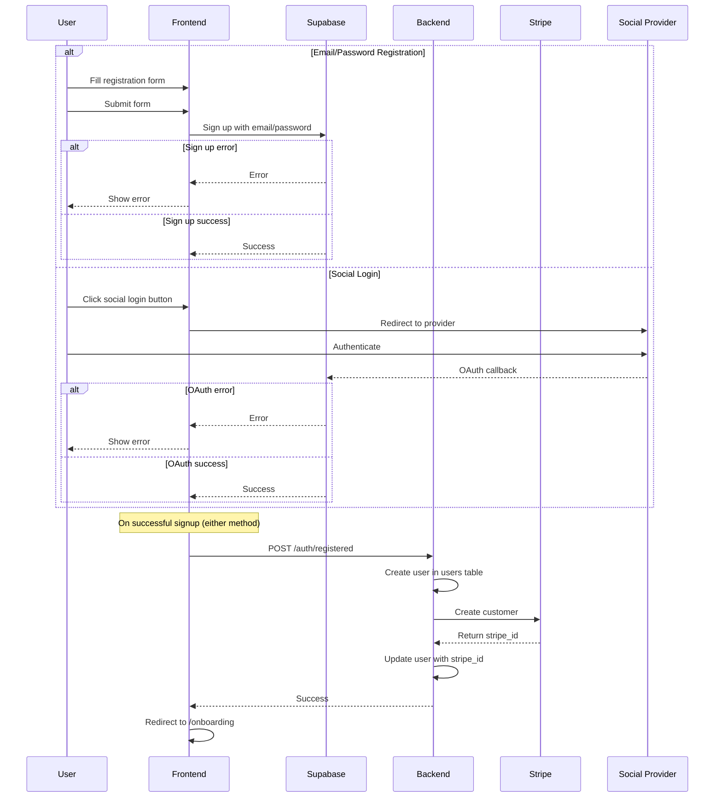

```mermaid
    sequenceDiagram
        participant User
        participant Frontend
        participant Supabase
        participant Backend
        participant Stripe
        participant Social as Social Provider

        alt Email/Password Registration
            User->>Frontend: Fill registration form
            User->>Frontend: Submit form
            Frontend->>Supabase: Sign up with email/password
            alt Sign up error
                Supabase-->>Frontend: Error
                Frontend-->>User: Show error
            else Sign up success
                Supabase-->>Frontend: Success
            end
        else Social Login
            User->>Frontend: Click social login button
            Frontend->>Social: Redirect to provider
            User->>Social: Authenticate
            Social-->>Supabase: OAuth callback
            alt OAuth error
                Supabase-->>Frontend: Error
                Frontend-->>User: Show error
            else OAuth success
                Supabase-->>Frontend: Success
            end
        end

        Note over Frontend: On successful signup (either method)
        
        Frontend->>Backend: POST /auth/registered
        Backend->>Backend: Create user in users table
        Backend->>Stripe: Create customer
        Stripe-->>Backend: Return stripe_id
        Backend->>Backend: Update user with stripe_id
        Backend-->>Frontend: Success
        Frontend->>Frontend: Redirect to /onboarding
```